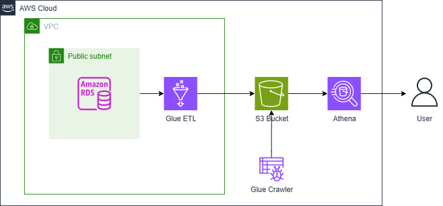

# Data Engineering Lifecycle Project

This project demonstrates an end-to-end data engineering pipeline using AWS services. It transforms data from a MySQL database into an optimized format for analytics, implementing a complete ETL (Extract, Transform, Load) process.

## Project Overview

The project simulates a retail scenario for a classic cars and transport models retailer. It takes transactional data stored in a MySQL database and transforms it into an analytics-ready format using a star schema, making it easier for data analysts to query and analyze sales patterns.

## Architecture



The pipeline consists of these main components:

- **Source Database**: MySQL database hosted on Amazon RDS containing transactional data
- **ETL Process**: AWS Glue job for data extraction, transformation, and loading
- **Storage**: Amazon S3 for storing transformed data in Parquet format
- **Query Interface**: Amazon Athena for analyzing the transformed data

## Prerequisites

- AWS Account with appropriate permissions
- Terraform installed
- MySQL client
- AWS CLI
- Access to VSCode or similar IDE

## Database Structure

### Source Schema
The source database contains the following tables:
- customers
- products
- productlines
- orders
- orderdetails
- payments
- employees
- offices

### Target Schema (Star Schema)
The data is transformed into:
- fact_orders (central fact table)
- dimension tables for:
  - customers
  - customer locations
  - order details

## Setup Instructions

1. Set up environment variables:
```bash
source scripts/setup.sh
```

2. Initialize Terraform:
```bash
cd terraform
terraform init
```

3. Deploy infrastructure:
```bash
terraform plan
terraform apply
```

4. Start the ETL job:
```bash
aws glue start-job-run --job-name de-c1w2-etl-job | jq -r '.JobRunId'
```

5. Monitor job status:
```bash
aws glue get-job-run --job-name de-c1w2-etl-job --run-id <JobRunID> --output text --query "JobRun.JobRunState"
```

## Project Structure

```
├── data/
│   └── mysqlsampledatabase.sql
├── terraform/
│   ├── assets/
│   │   └── glue_job.py
│   └── *.tf
├── scripts/
│   └── setup.sh
├── images/
└── C1_W2_Dashboard.ipynb
```

## Data Analysis

After the ETL process is complete, data analysts can:
1. Use Amazon Athena to query the transformed data
2. Create visualizations using the Jupyter notebook provided
3. Analyze sales patterns, product performance, and geographic distribution of sales

## Security

Database credentials:
- Username: admin
- Port: 3306

Note: Actual passwords should be managed through secure parameter storage in production environments.

## Important Notes

- The AWS console URL expires every 15 minutes
- If the terminal crashes during Terraform operations, reopen it and retry the commands
- Allow 2-3 minutes for the Glue job to complete
- The transformed data structure optimizes for analytical queries through denormalization

## Troubleshooting

If you encounter terminal crashes during Terraform operations, use:
```bash
terraform apply -no-color 2> errors.txt
```

For AWS console access issues, regenerate the URL using:
```bash
cat ../.aws/aws_console_url
```