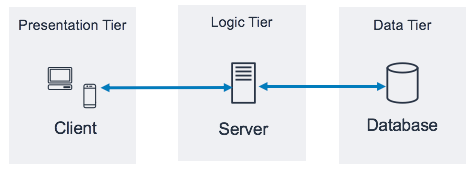

# AWS Web Application Monitoring & Scaling Lab

## Overview
This lab explores the security, performance, reliability, and scalability aspects of a web application hosted on AWS. By simulating traffic to your web application and using AWS tools like Amazon CloudWatch, you'll gain hands-on experience with cloud infrastructure monitoring and management.

The lab applies principles of good data architecture and the AWS Well-Architected Framework to understand how to:
- Monitor computing resources and network activity
- Configure security settings for web traffic
- Test system availability across multiple zones
- Implement auto-scaling for efficient resource management

## Architecture
The lab uses a three-tier architecture:
- **Presentation Tier**: Web interface for client interaction
- **Logic Tier**: Application logic (running on EC2 instances)
- **Data Tier**: Data storage (S3)

Key components include:
- **Amazon EC2 Auto Scaling Group**: Collection of EC2 instances running application logic
- **Application Load Balancer (ALB)**: Distributes incoming traffic across EC2 instances
- **Virtual Private Cloud (VPC)**: Isolates and organizes AWS resources
- **Security Groups**: Control inbound/outbound traffic



## Prerequisites
- AWS account access
- Basic understanding of AWS services (EC2, CloudWatch, Security Groups)
- Basic knowledge of networking concepts (ports, HTTP)

## Lab Sections

### 1. Introduction
Overview of the lab's purpose and architecture.

### 2. Getting the Address of the Web Application
- Access the AWS console
- Locate the Application Load Balancer
- Test the web application connection

### 3. Monitoring CPU Usage and Networking Activity
- Use Apache Benchmark to simulate traffic
- Monitor system performance with CloudWatch
- Analyze CPU usage and network metrics

### 4. Enhancing Security
- Test access through different ports
- Configure security groups for the ALB
- Restrict traffic to authorized ports only

### 5. Checking EC2 Availability
- Understand multi-AZ deployment benefits
- Test application availability across zones
- Learn about fault tolerance and high availability

### 6. Performing Auto Scaling
- Optimize instance types for efficiency (t3.nano)
- Configure dynamic scaling policies
- Test auto-scaling with simulated traffic loads

## Key Learning Objectives
- Implement security best practices in cloud architecture
- Monitor system performance under varying loads
- Configure high-availability across multiple zones
- Set up auto-scaling for cost-efficiency and performance

## Commands Reference

### Apache Benchmark Testing
Basic load test:
```bash
ab -n 7000 -c 50 http://<ALB-DNS>/
```

Heavy load test:
```bash
ab -n 1000000 -c 200 http://<ALB-DNS>/
```

## AWS Well-Architected Framework Principles Applied
- **Security**: Restricting access through security groups
- **Reliability**: Multi-AZ deployments for fault tolerance
- **Performance Efficiency**: Right-sizing instances (t3.nano)
- **Cost Optimization**: Auto-scaling based on demand
- **Operational Excellence**: Monitoring and observability with CloudWatch

## Troubleshooting Tips
- If you encounter "This site can't be reached" errors, check if you're using HTTP instead of HTTPS
- CloudWatch metrics have a 5-10 minute latency; refresh to see updates
- If new template version doesn't apply, verify you selected the correct instance type (t3.nano)
