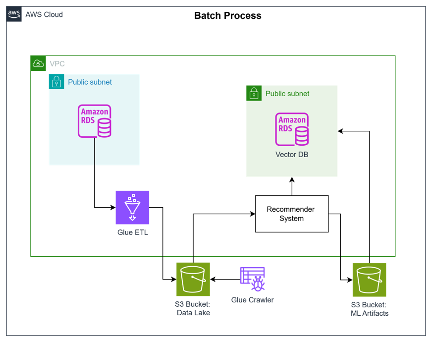
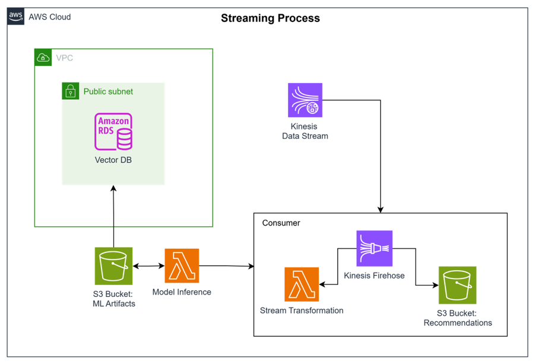

# End-to-End Batch and Streaming Pipelines Project

This project implements end-to-end batch and streaming data pipelines for a product recommendation system. It demonstrates how to build data engineering solutions based on stakeholder requirements using AWS services.

## Project Overview

The project consists of two main components:

1. **Batch Pipeline**: Processes product and user data from a MySQL database, transforms it using AWS Glue ETL, and stores it in S3 for model training.

2. **Streaming Pipeline**: Implements real-time product recommendations using Kinesis Data Streams, Lambda functions, and a vector database.

## Architecture

### Batch Pipeline

- **Data Source**: Amazon RDS MySQL database containing product, user, and ratings data
- **Transformation**: AWS Glue ETL job
- **Storage**: Amazon S3 data lake

### Streaming Pipeline

- **Data Source**: Kinesis Data Streams (user activity)
- **Processing**: Lambda functions for model inference
- **Vector Database**: PostgreSQL with pgvector extension
- **Delivery**: Kinesis Firehose
- **Storage**: Amazon S3 recommendation bucket

## Components

1. **MySQL Database**: Contains the product catalog and user ratings
2. **AWS Glue ETL**: Transforms raw data into training data
3. **Vector Database**: Stores product and user embeddings for fast similarity search
4. **Lambda Functions**: 
   - Model inference: Uses trained model and vector DB to generate recommendations
   - Stream transformation: Processes streaming data
5. **Kinesis Data Streams**: Captures real-time user activity
6. **Kinesis Firehose**: Delivers processed data to S3
7. **S3 Buckets**:
   - Data lake: Stores transformed training data
   - ML artifacts: Contains trained models and embeddings
   - Recommendations: Stores generated recommendations

## Implementation

The project is implemented using Infrastructure as Code (IaC) with Terraform to provision and configure AWS resources.

## Prerequisites

- AWS account
- Terraform
- MySQL client
- PostgreSQL client (psql)

## Setup Instructions

1. Set up environment variables
2. Initialize and apply Terraform configurations
3. Connect to databases and run SQL scripts
4. Configure Lambda environment variables
5. Monitor data flow through the pipelines

## Data Flow

1. Batch pipeline ingests data from MySQL, transforms it with AWS Glue, and stores it in S3
2. ML model is trained on the transformed data
3. Embeddings are stored in the vector database
4. Streaming pipeline captures real-time user activity
5. Lambda functions use the trained model and vector database to generate recommendations
6. Recommendations are delivered to S3 via Kinesis Firehose

## Project Structure

.
├── images/                  # Architecture diagrams
├── scripts/                 # Setup scripts
├── sql/                     # SQL scripts for database operations
├── terraform/               # IaC configurations
│   ├── main.tf              # Main Terraform configuration
│   └── outputs.tf           # Terraform outputs
└── README.md                # This file

## Technologies Used

- AWS RDS (MySQL and PostgreSQL)
- AWS Glue
- AWS Lambda
- AWS Kinesis Data Streams
- AWS Kinesis Firehose
- Amazon S3
- Terraform
- pgvector (Vector database extension)

This README provides a comprehensive overview of the project, explaining its architecture, components, implementation details, and setup instructions. It would help anyone understand the purpose and structure of the project at a glance.
